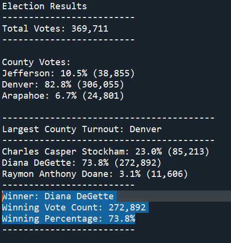

# Election Analysis using Python

## Overview 

The goal of the project was to complete an election audit of a local congressional election using python programming language.

### Tasks

#### How many votes were cast in this congressional election?
369,711
#### Provide a breakdown of the number of votes and the percentage of total votes for each county in the precinct.
County Votes:
Jefferson: 10.5% (38,855)
Denver: 82.8% (306,055)
Arapahoe: 6.7% (24,801)
#### Which county had the largest number of votes?
Denver
#### Provide a breakdown of the number of votes and the percentage of the total votes each candidate received.
Charles Casper Stockham: 23.0% (85,213)
Diana DeGette: 73.8% (272,892)
Raymon Anthony Doane: 3.1% (11,606)
#### Which candidate won the election, what was their vote count, and what was their percentage of the total votes?
Winner: Diana DeGette
Winning Vote Count: 272,892
Winning Percentage: 73.8%

## Election audit results

## Summary 
The script can be modified to get the most quantity of votes from different cities assuming that the data includes this kind of information. Breaking down the analysis this way we could go deeper in the analysis. 

The code can also be changed to determine patterns testing the percentage of votes by city against each candidate. This would tell us which candidate was the most popular in each city or county.

